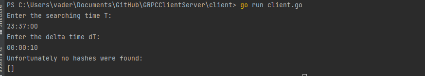
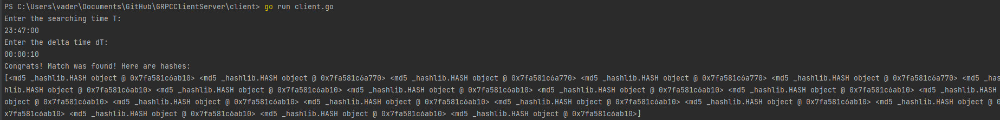

# LocatingRecordsInLogs-gRPC
A distributed program for locating requested records in the log files using gRPC.
---
Name: Nikita Mashchenko
---

### Development Environment
+ Windows 10
+ GO version 1.19.2
+ IntelliJ IDEA Ultimate

## Entire Setup of the Project:

### Steps to Run the gRPC Application
- Clone the github repo on your local machine.
- Open the command line at the root of the project.
- Enter protoc --proto_path=proto proto/*.proto --go_out=gen/proto/ (if not already created) or use makefile
- Enter protoc --proto_path=proto proto/*.proto --go-grpc_out=gen/proto/ (if not already created) or use makefile
- cd into server and do : go run server.go
- in case server did'nt start, perform required installations like go get google.golang.org/grpc
- open another terminal, cd into client and do : go run client.go
- enter the required time and delta time to run the application

## Overview
The GRPC client make a request to the server, and server make request to API gateaway that is redirected to GET request where lambda function calculates 
if desired input is in file and returns following: 
If the logs are present, the response returned is the md5 hash of logs with a statusCode of 200.  
If no logs were present in the timerange, the response is a 400-level message with a message that logs were not present in the time range.

## Output
When logs are not present:  

 
When logs are present:  

 

## All repos:

https://github.com/exortme1ster/AkkaLogsHandler
https://github.com/exortme1ster/GRPCClientServer
https://github.com/exortme1ster/LogFileGenerator
https://github.com/exortme1ster/pythonLambda

## Video:
https://www.youtube.com/watch?v=fmeBeOcpBy0
